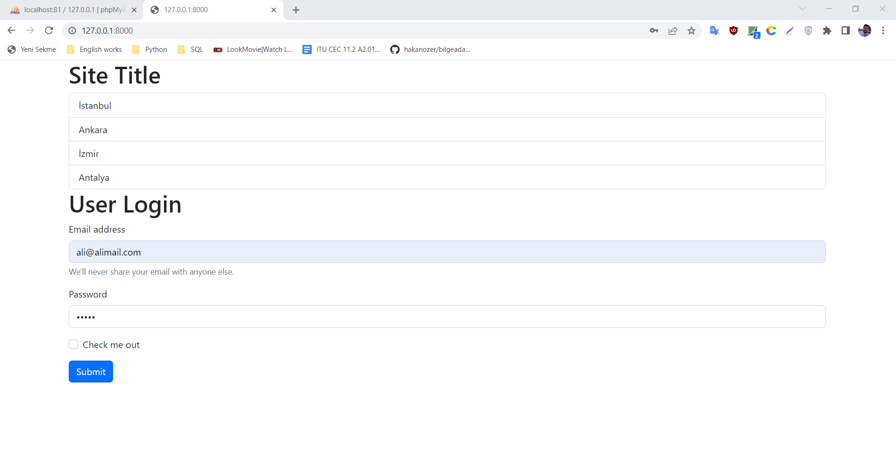
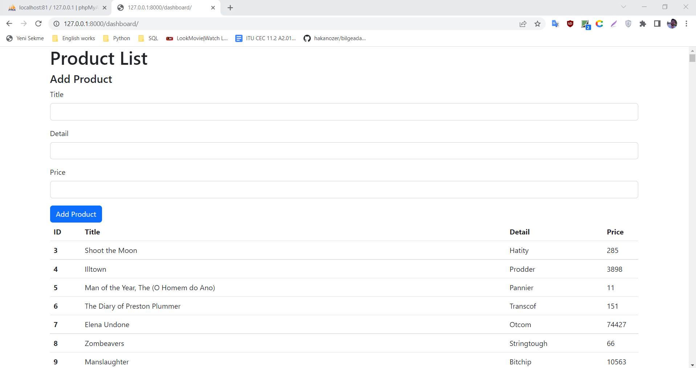
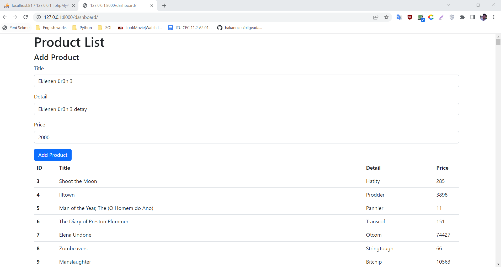
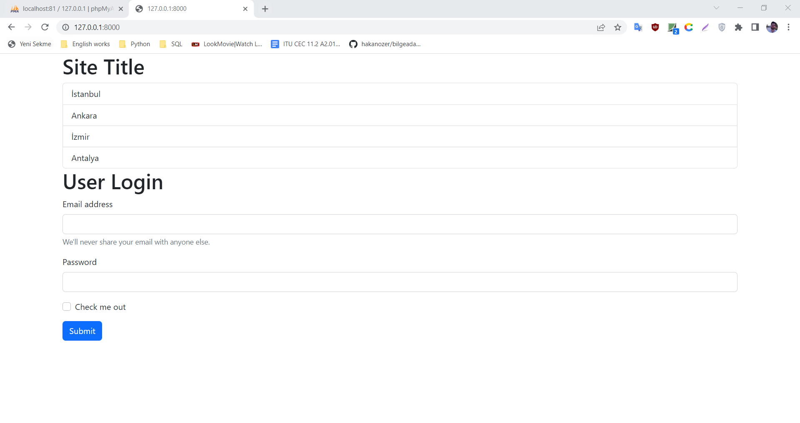
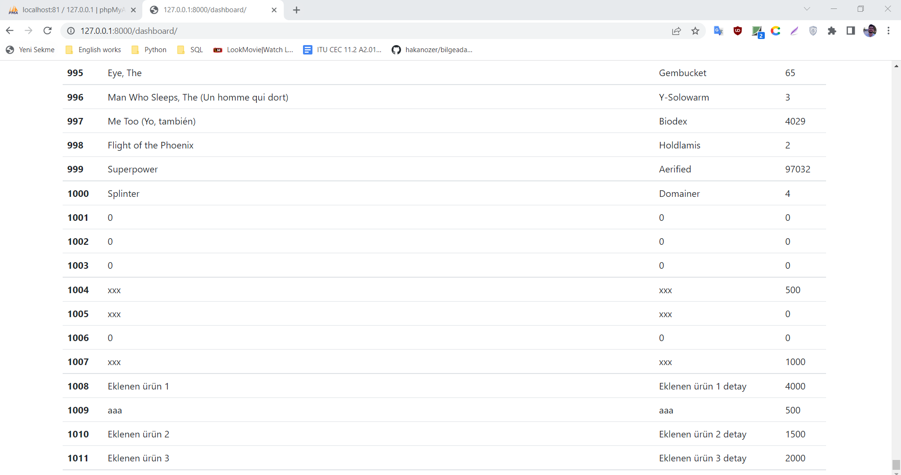

# webproject

Within the scope of the Bilge Adam Yetiştirme Programı Python Eğitimi, I made a small application about product tracking and management in this web project. 
I used Python's Django Web Development Framework during the project development stages.
I used MySQL as database and got help from Bootstrap css library for styles.

## Home page

## User login on home page

## Dashboard page that opens when the correct user logs in

## Adding a new product record

## After adding a new product registration, redirection to the homepage and re-login process

## Viewing the last added product records by the user

